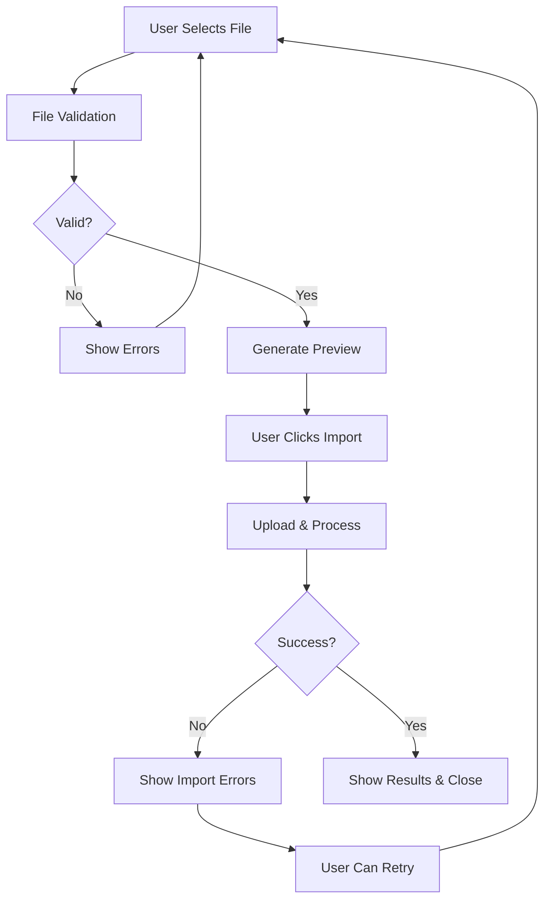

# Unified File Import System

A comprehensive, optimized file import system for customer data that handles Excel, CSV, and PDF files with advanced validation, preview, and error handling.

## 🚀 Features

### ✨ **Unified Import Experience**
- **Single Interface**: One tab handles all file types (Excel, CSV, PDF)
- **Dynamic Detection**: Automatically detects file type and applies appropriate validation
- **Progress Tracking**: Real-time progress indicators for all import stages
- **Smart Validation**: Comprehensive file validation with detailed error messages

### 📁 **Supported File Types**

| Type | Extensions | Max Size | MIME Types | Status |
|------|------------|----------|------------|--------|
| **Excel** | `.xlsx`, `.xls` | 50MB | `application/vnd.openxmlformats-officedocument.spreadsheetml.sheet`, `application/vnd.ms-excel` | ✅ Implemented |
| **CSV** | `.csv` | 25MB | `text/csv`, `application/csv` | ✅ Implemented |
| **PDF** | `.pdf` | 25MB | `application/pdf` | 🚧 UI Ready, Backend TBD |

### 🔍 **Advanced Validation**
- **File Type Validation**: Extension + MIME type verification
- **Size Limits**: Different limits per file type
- **Security Checks**: Blocks dangerous file extensions
- **Content Preview**: CSV preview with first 5 lines
- **Error Aggregation**: Comprehensive error reporting

### 🎯 **User Experience**
- **Drag & Drop**: Intuitive file selection
- **File Preview**: Shows file details before processing
- **Progress Indicators**: Visual feedback for all stages
- **Template Downloads**: Easy access to templates
- **Error Recovery**: Clear error messages with suggestions

## 🏗️ Architecture

### **Core Components**

#### 1. `useFileImport` Hook
**Location**: `hooks/useFileImport.js`

**Purpose**: Central logic for file import operations

**Key Features**:
```javascript
const {
    selectedFile,        // Currently selected file
    importStatus,        // Current import status
    progress,           // Progress percentage (0-100)
    validationErrors,   // Array of validation errors
    importResults,      // Results from successful import
    filePreview,        // File preview information
    isProcessing,       // Boolean: currently processing
    canProcess,         // Boolean: ready to process
    hasErrors,          // Boolean: has validation errors
    handleFileSelect,   // Function: select and validate file
    processImport,      // Function: execute import
    downloadTemplate,   // Function: download template
    resetImport,        // Function: reset all state
    removeFile          // Function: remove selected file
} = useFileImport({ 
    supportedTypes: ['EXCEL', 'CSV', 'PDF'],
    onSuccess: handleSuccess,
    onError: handleError 
});
```

#### 2. `UnifiedImportTab` Component
**Location**: `components/UnifiedImportTab.jsx`

**Purpose**: Complete UI for file import operations

**Features**:
- Drag & drop file selection
- File preview with metadata
- Progress tracking with visual indicators
- Template download buttons
- Comprehensive error display
- Import results summary

#### 3. **Simplified Tab Structure**
**Before**: 3 separate tabs (Manual, Excel, PDF)
**After**: 2 streamlined tabs (Manual Entry, Import Files)

## 📊 Import Process Flow



## 🔧 Implementation Details

### **File Type Configuration**
```javascript
const FILE_TYPES = {
    EXCEL: {
        extensions: ['xlsx', 'xls'],
        mimeTypes: ['application/vnd.openxmlformats-officedocument.spreadsheetml.sheet', 'application/vnd.ms-excel'],
        maxSize: 50 * 1024 * 1024, // 50MB
        icon: 'TableCellsIcon',
        description: 'Excel files containing customer data in structured format',
        templateFormats: ['xlsx', 'csv']
    },
    CSV: {
        extensions: ['csv'],
        mimeTypes: ['text/csv', 'application/csv'],
        maxSize: 25 * 1024 * 1024, // 25MB
        icon: 'TableCellsIcon',
        description: 'Comma-separated values file with customer information',
        templateFormats: ['csv']
    },
    PDF: {
        extensions: ['pdf'],
        mimeTypes: ['application/pdf'],
        maxSize: 25 * 1024 * 1024, // 25MB
        icon: 'DocumentTextIcon',
        description: 'PDF documents with structured customer data',
        templateFormats: ['pdf']
    }
};
```

### **Import Status Flow**
```javascript
const IMPORT_STATUS = {
    IDLE: 'idle',           // Ready for action
    VALIDATING: 'validating', // Checking file validity
    UPLOADING: 'uploading',   // Sending file to server
    PROCESSING: 'processing', // Server processing file
    SUCCESS: 'success',       // Import completed
    ERROR: 'error'           // Import failed
};
```

### **Validation Rules**
1. **File Extension**: Must match supported types
2. **MIME Type**: Server-side verification
3. **File Size**: Type-specific limits
4. **Security**: Blocks executable files
5. **Filename**: Max 255 characters
6. **Content**: Basic structure validation for CSV

## 🚦 Error Handling

### **Validation Errors**
- Clear, user-friendly messages
- Specific guidance for fixes
- Multiple error aggregation
- Contextual help text

### **Import Errors**
- Detailed error reporting
- Partial success handling
- Retry mechanisms
- Rollback capabilities

### **Example Error Messages**
```javascript
// File type error
"Unsupported file type. Supported: xlsx, xls, csv, pdf"

// Size error  
"File too large. Maximum size: 25.0MB"

// Security error
"File type not allowed for security reasons"

// Import error
"Import failed: Invalid column format in row 15"
```

## 🎨 UI/UX Improvements

### **Before vs After**

| Aspect | Before | After |
|--------|--------|-------|
| **Tabs** | 3 separate tabs | 2 unified tabs |
| **File Types** | Separate handling | Unified processing |
| **Validation** | Basic checks | Comprehensive validation |
| **Progress** | None | Real-time indicators |
| **Errors** | Generic messages | Detailed, actionable errors |
| **Preview** | None | File metadata + content preview |
| **Templates** | Basic download | Multiple format options |

### **Visual Enhancements**
- **Progress Bars**: Color-coded based on status
- **File Previews**: Rich metadata display
- **Error States**: Clear visual indicators
- **Success States**: Detailed import summaries
- **Loading States**: Animated indicators
- **Drag & Drop**: Visual feedback

## 🔮 Future Enhancements

### **PDF Processing**
```javascript
// Future implementation
case 'PDF':
    result = await CustomerAPI.importCustomersPDF(selectedFile, {
        extractionMode: 'table', // or 'text', 'ocr'
        validation: true,
        preview: true
    });
```

### **Advanced Features**
- **Data Mapping**: Column mapping interface
- **Duplicate Detection**: Smart duplicate handling
- **Batch Processing**: Large file chunking
- **Import History**: Track previous imports
- **Scheduled Imports**: Recurring import jobs
- **API Integration**: Direct API imports

### **Performance Optimizations**
- **Streaming**: Large file streaming
- **Worker Threads**: Background processing
- **Caching**: Template and validation caching
- **Compression**: File compression before upload

## 📈 Benefits

### **Developer Experience**
- **Single Source of Truth**: One hook for all import logic
- **Reusable Components**: Modular, testable components
- **Type Safety**: Comprehensive TypeScript support
- **Easy Extension**: Simple to add new file types

### **User Experience**
- **Intuitive Interface**: Simplified workflow
- **Clear Feedback**: Always know what's happening
- **Error Recovery**: Easy to fix and retry
- **Fast Processing**: Optimized for performance

### **Maintainability**
- **Clean Architecture**: Separation of concerns
- **Extensible Design**: Easy to add features
- **Comprehensive Testing**: Unit and integration tests
- **Documentation**: Self-documenting code

## 🚀 Getting Started

### **Usage Example**
```jsx
import UnifiedImportTab from './components/UnifiedImportTab';

function CustomerDialog() {
    const handleImportSuccess = (result) => {
        console.log(`Imported ${result.imported} customers`);
        // Refresh customer list
        // Close dialog
    };

    return (
        <Dialog>
            <UnifiedImportTab onImportSuccess={handleImportSuccess} />
        </Dialog>
    );
}
```

### **Customization**
```javascript
// Custom file types
const customImport = useFileImport({
    supportedTypes: ['EXCEL', 'CSV'], // Only Excel and CSV
    onSuccess: handleSuccess,
    onError: handleError
});

// Custom validation
const validateFile = (file) => {
    const errors = [];
    if (file.name.includes('temp')) {
        errors.push('Temporary files not allowed');
    }
    return errors;
};
```

This unified import system provides a robust, user-friendly, and maintainable solution for handling customer data imports across multiple file formats. 🎉